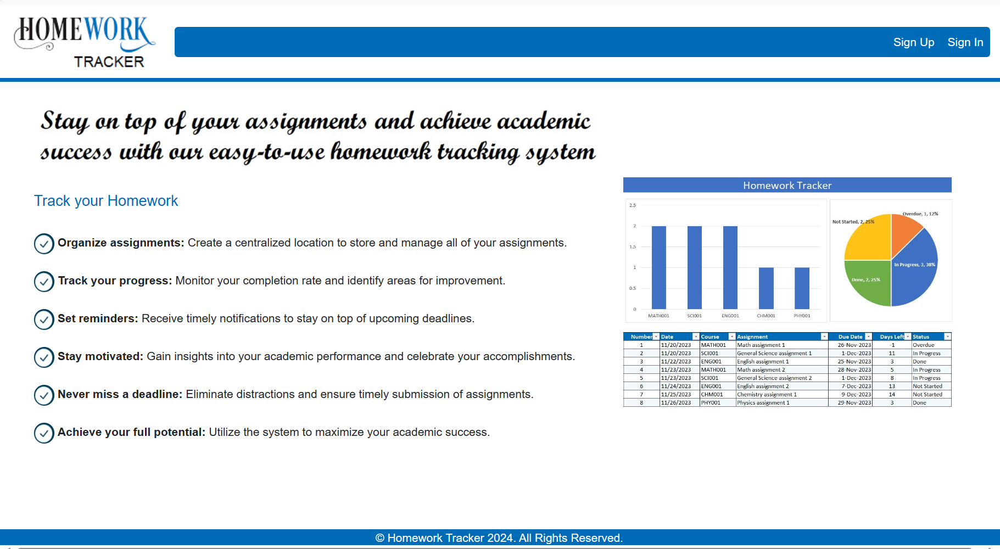
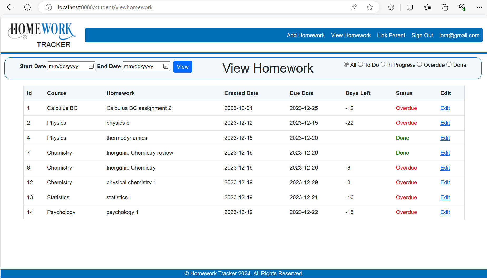
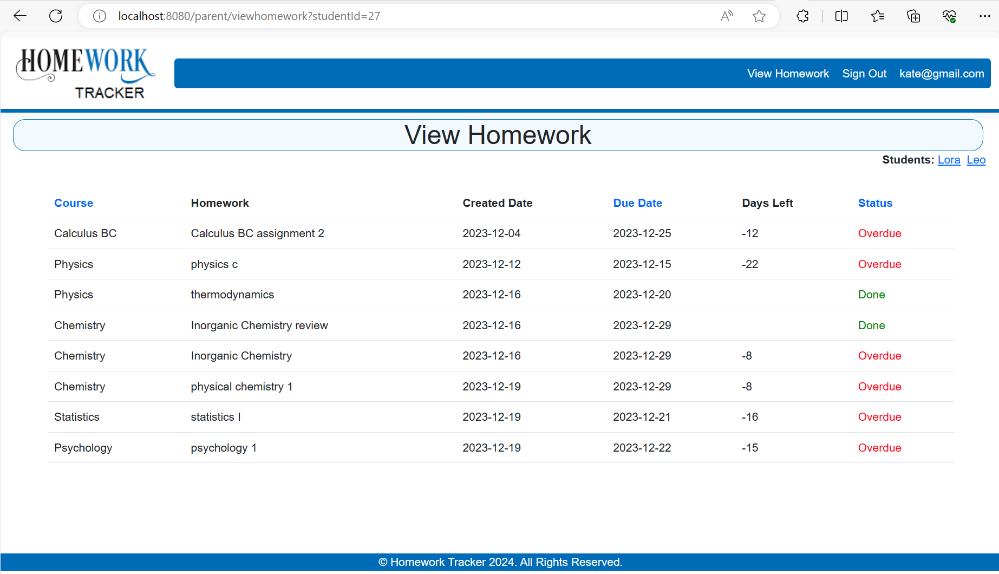
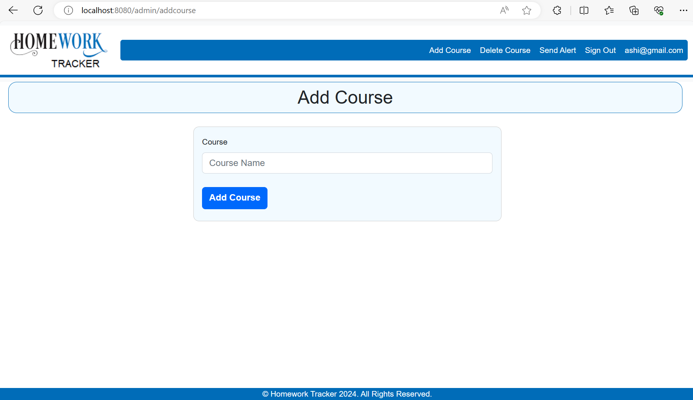

# Homework-Tracker
**Introduction:**
Student-Parent Homework Tracking System/(Homework Tracker): This innovative platform aims to revolutionize how students, parents, handle homework, fostering better communication, organization, and ultimately, academic success.

**Problem:**
Juggling schoolwork, extracurricular activities, and family life can be overwhelming. Homework often gets lost in the shuffle, leading to missed deadlines, frustration, and strained relationships. Parents struggle to stay informed about assignments, while students lack a centralized system to track progress and prioritize tasks.

**Solution:**
Centralized Platform: Manage homework for all subjects in one convenient location. No more scattered notes or lost assignments!
Automatic Updates: Students can add and update homework directly on the platform, ensuring parents is always on the same page.
Track Progress: Monitor your child's homework progress with To-Do, In-Progress, Done and Overdue status. Never miss the deadline!
Two-way Communication: Parents can easily view the homework status directly through the platform.
Customization: Select homework within the date range, Sort homework by course and filter homework by status.

**Features:**
Admin: can add/delete new courses to the table
Parent: can see the students homework by clicking on respective student link also allow to sort the homework by course and due date
Student: can add/edit homework, Link Parents, filter by date range, and status

**Benefits:**
Improved Student Performance: Organized and informed students achieve higher grades and feel more confident in their abilities.
Reduced Stress: Eliminates confusion and last-minute scrambling, creating a calmer and more productive learning environment.
Stronger Student-Parent Communication: Open communication leads to better support and understanding of student needs.
Increased Efficiency: Save time and energy by using a streamlined system for managing homework.

**Call to Action:**
Ready to join the Homework Tracking revolution? Sign up for the system today and experience the difference!

**First time user homepage**

**Logged in as Student**

**Logged in as Parent**

**Logged in as Admin**

